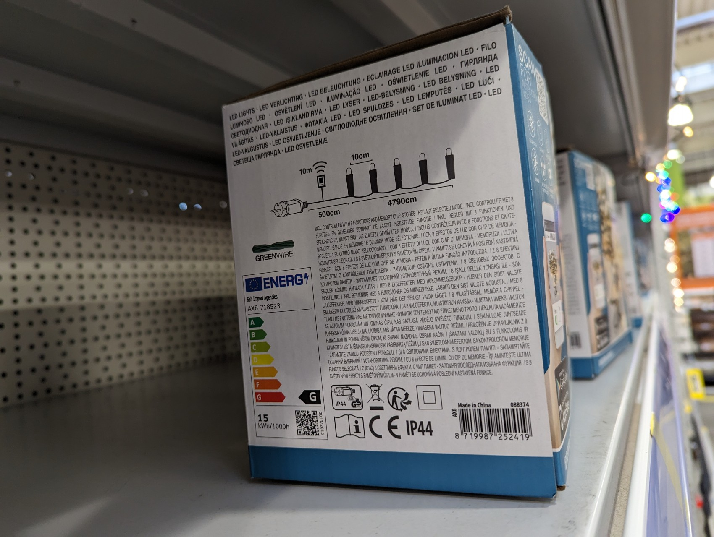
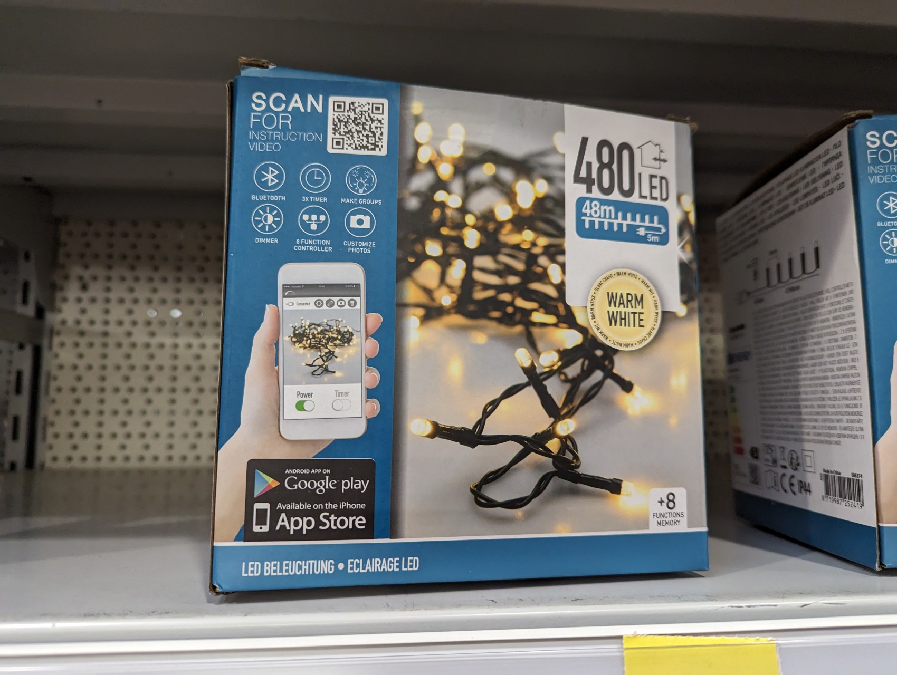

# HomeAssistant - Tapo: Cameras Control

Custom component that allows control of lights by [Lights App](https://play.google.com/store/apps/details?id=com.novolink.lightapp&hl=en_US)

## Installation

Copy contents of custom_components/lights_app/ to custom_components/lights_app/ in your Home Assistant config folder.

## Installation using HACS

Add this repository as custom repository.

HACS is a community store for Home Assistant. You can install [HACS](https://github.com/custom-components/hacs) and then install Lights App from the HACS store.